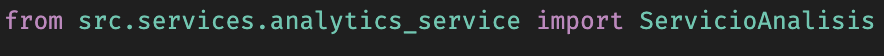
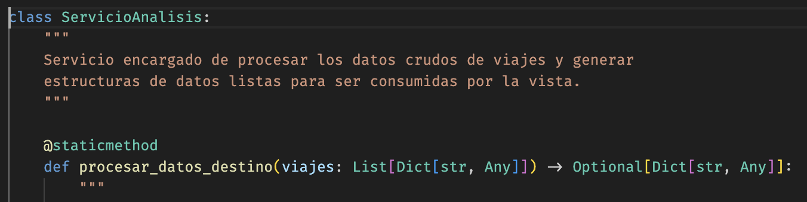
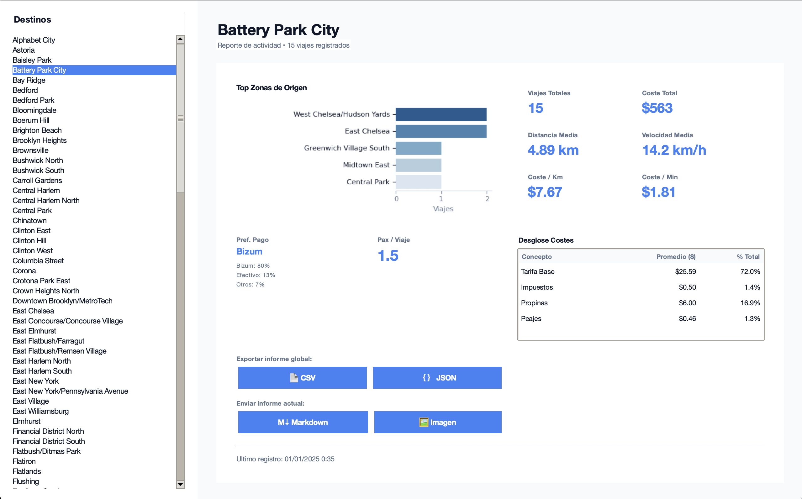
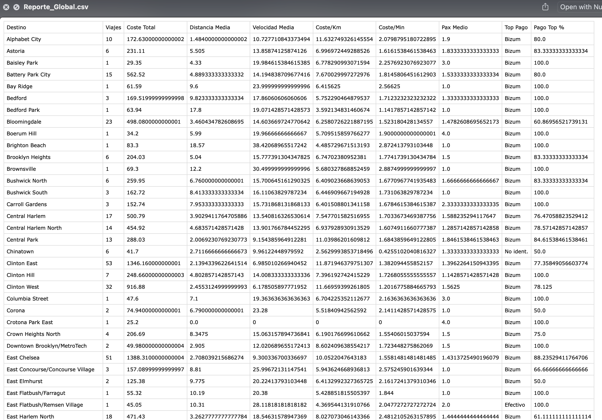
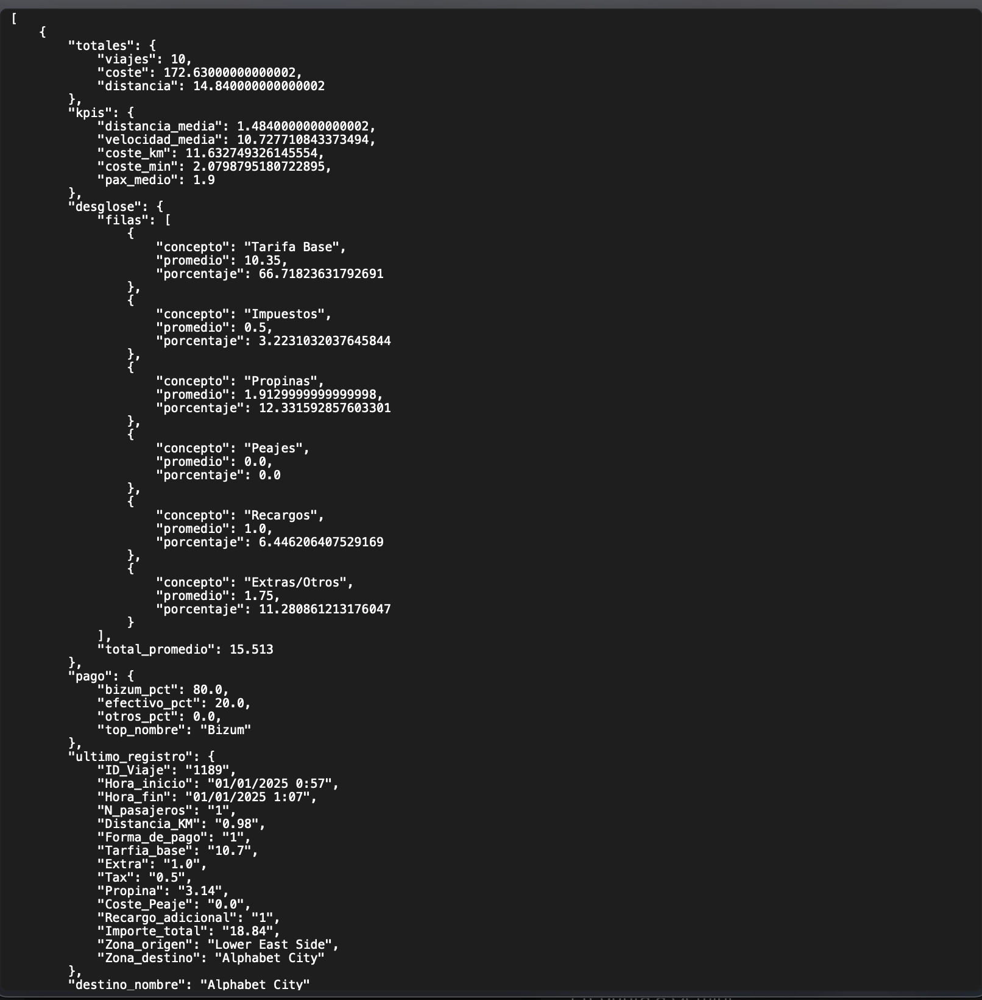
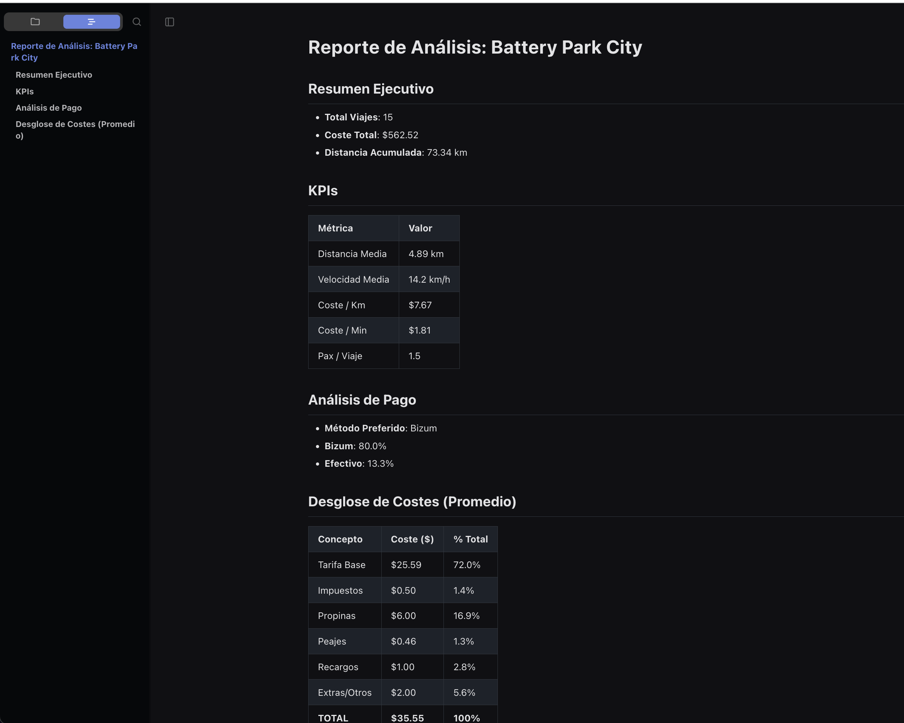
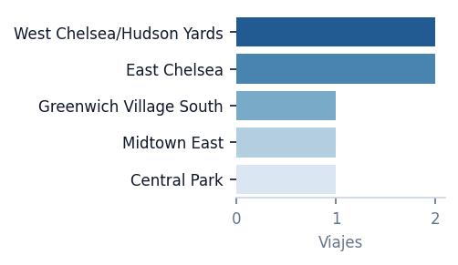

# Trabajo Final Programación II

_Autor: **David Gutiérrez**_

_Profesor: Jorge Raúl Maradiaga Chirinos_

### Descripción

Análisis de datos de viajes de taxis en NY en enero de 2025.

### Implementación

Hemos usado Programación Orientada a Objetos para resolver este problema.

También hemos hecho uso de bibliotecas como matplotlib, seaborn y pandas para el análisis de datos.

### Uso de la IA

Nos hemos apoyado de la IA para el uso de la biblioteca tkinter. También hemos usado la documentación oficial.

Para bibliotecas como seaborn y matplotlib, tenemos conocimientos de la asignatura Visualizacion de Datos.

Aunque también nos hemos apoyado en la IA y la documentacion.

## Planteamiento

Lo primero que he hecho ha sido evaluar los headings del archivo csv para entender los datos que tenemos.

Una vez realizadas las respuestas del enunciado, he creado algunas métricas extras para darle un toque más completo y creativo.

Luego he creado un dashboard con tkinter (ayudado por la IA) para mostrar los datos de manera visual.

Luego he limpiado y refactorizado el código para que quede completamente legible y estructurado.

Veamos como ha quedado.

## Uso de conceptos avanzados

- ¿Para qué usamos los \_\_init\_\_.py?

Básicamente para que Python los reconozca como paquetes. Esto sirve a la hora de importarlos.



- ¿Por que usamos @staticmethod?

@staticmethod es un decorador que nos permite definir métodos que no necesitan acceder a ningún atributo o método de la clase.



## Estructura del proyecto

El proyecto está estructurado de la siguiente manera:

```
taxis_prog_II/
├── venv/
├── data/
│   └── NYC_202501.csv
├── src/
│   ├── config.py
│   ├── app.py
│   ├── models/
│   │   ├── __init__.py
│   │   └── data_model.py
│   ├── services/
│   │   ├── __init__.py
│   │   └── analytics_service.py
│   ├── controllers/
│   │   ├── __init__.py
│   │   └── main_controller.py
│   └── views/
│       ├── __init__.py
│       ├── main_view.py
│       └── styles.py
├── README.md
├── requirements.txt
└── main.py
```

#### Cómo funciona

El punto de entrada del programa es el archivo main.py.

Al ejecutarlo, se crea una instancia de la clase Aplicacion y se llama al método mainloop.

Esto mantiene abierta la ventana principal del programa.

## Bibliotecas usadas

- tkinter: para la creación de la UI de escritorio
- matplotlib: para la creación de gráficas
- seaborn: para la creación de gráficas
- pandas: para el análisis de datos.

#### Extensiones IDE

Estas son las extensiones que me ayudan a mantener el código limpio y bien estructurado.

- Ruff: linter y formatter para Python
- Excel Viewer: para visualizar archivos csv
- Error Lens: para visualizar errores en el código
- Python: para Intellisense y autocompletado

## Instalación y ejecución

Consejo: Crear entorno virtual.

```bash
python3 -m venv venv
```

```bash
source venv/bin/activate
```

Para instalar las dependencias, ejecuta el siguiente comando:

```bash
pip install -r requirements.txt
```

Para ejecutar el programa, ejecuta el siguiente comando:

```bash
python main.py
```

## Preview



### Exportaciones

He creado diferentes tipos de exportaciones.

Exportaciones globales, agrupan por destino y calculan métricas. **CSV y JSON**

Exportaciones locales, solo exportan métricas del destino seleccionado. **MD y PNG**

**CSV**



**JSON**



**MD**

Exporta un archivo de markdown con un informe personalizado.



**PNG**

Exporta solo la imagen de la gráfica.


